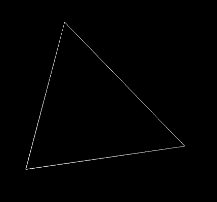

# p5.js Experiments

A gallery of six p5.js experiments by Michael Kolesidis.

## Experiments

### Perlin Landscape

Landscape created dynamically using Perlin noise.

[GitHub](https://github.com/michaelkolesidis/perlin-landscape)

[Deployment](https://perlin-landscape.vercel.app/)

### Particircle

A circle of particles.

[GitHub](https://github.com/michaelkolesidis/particircle)

[Deployment](https://particircle.vercel.app/)

### Fractal Mountain

A single triangle transforms into a fraction of mountain.

[GitHub](https://github.com/michaelkolesidis/fractal-mountain)

[Deployment](https://fractal-mountain.vercel.app/)

### Interwoven Oversemantization

A circle created dynamically by random lines

[GitHub](https://github.com/michaelkolesidis/interwoven-oversemantization)

[Deployment](https://interwoven-oversemantization.vercel.app/)

### Scribble Text

Text gradually appears while scribbling.

[GitHub](https://github.com/michaelkolesidis/scribble-text)

[Deployment](https://scribble-text.vercel.app/)

### Intersecting Circles

Colorful explosions occur when two circles are intersecting.

[GitHub](https://github.com/michaelkolesidis/intersecting-circles)

[Deployment](https://intersecting-circles.vercel.app/)

## License

Copyright (c) 2025 Michael Kolesidis 
Licensed under the [GNU Affero General Public License v3.0](https://www.gnu.org/licenses/agpl-3.0.html).
